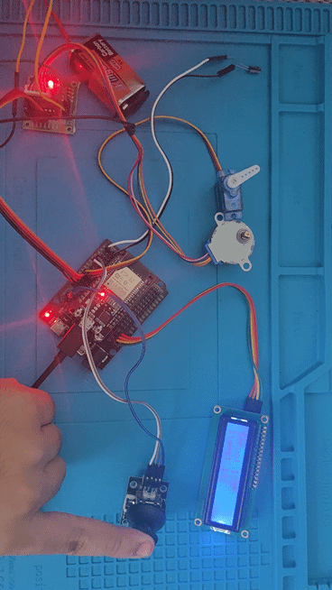
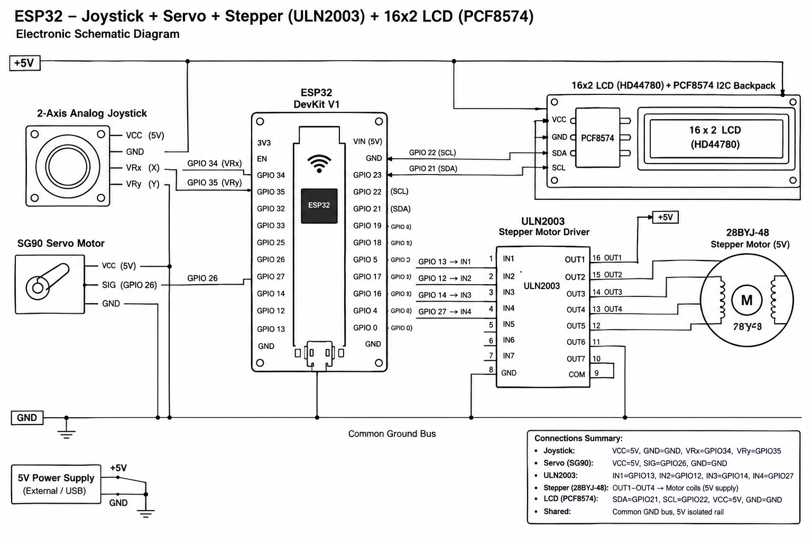
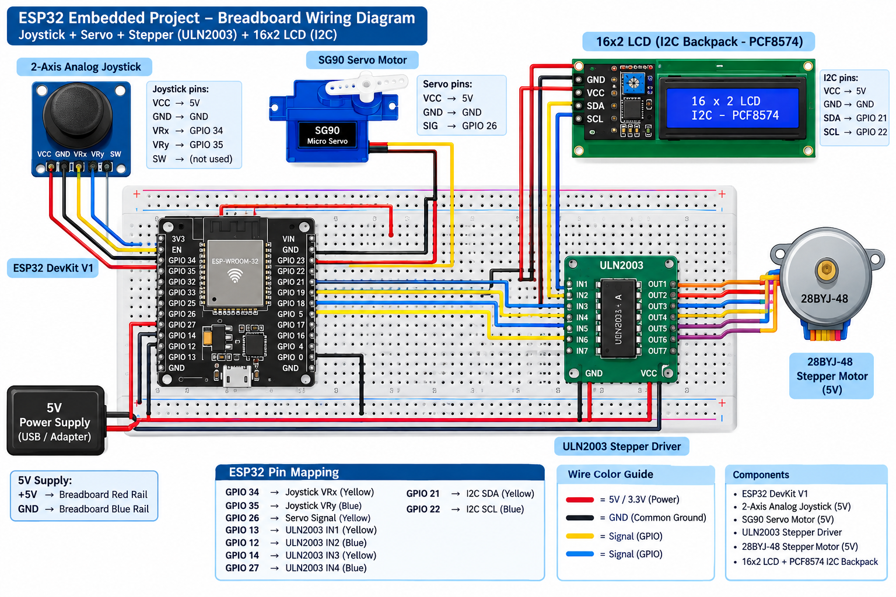

# 🏎️ ESP32 2-Axis Motion Control Robotic Arm System

An embedded dual-actuator motion control system built on the **ESP32 Dev Module**. The system processes real-time 2-axis analog joystick inputs, mapping the X-axis to high-resolution Servo Motor positioning ($0^\circ$ to $180^\circ$) via LEDC PWM, and the Y-axis to step-by-step Stepper Motor rotation (up to $\pm 2$ full revolutions CW/CCW) via a ULN2003 driver, featuring multi-tasking timing logic to eliminate pulse delays and output live 16x2 I2C LCD telemetry.

## 🎬 Project Demo


---

## 📌 Features

* **32-Bit LEDC PWM Servo Control (X-Axis)**: Precision angle positioning ($0^\circ$–$180^\circ$) on GPIO 18 with moving average noise suppression.
* **Non-Blocking Stepper Sequence (Y-Axis)**: Direct phase control for 28BYJ-48 stepper motor (GPIOs 12, 13, 14, 27) allowing exact step counting up to $\pm 2$ full rotations ($\pm 4096$ steps).
* **Hardware Power Decoupling**: External 5V rail architecture preventing motor torque power spikes from triggering ESP32 brownout resets.
* **Real-Time LCD Telemetry**: Synchronous 16x2 I2C display updating current Servo angle ($\theta$) and dynamic Stepper step count every 50ms.

---

## 🛠️ Hardware Requirements

| Component | Quantity | Description / Specification |
| --- | --- | --- |
| **ESP32 DevKit V1** | 1 | 32-bit Microcontroller Board (30-pin) |
| **2-Axis Joystick Module** | 1 | Dual Potentiometer Thumbstick Input |
| **Servo Motor** | 1 | SG90 Micro Servo / MG996R |
| **Stepper Motor** | 1 | 28BYJ-48 5V Stepper Motor |
| **Stepper Driver** | 1 | ULN2003 Darlington Transistor Array Driver Board |
| **16x2 LCD Display** | 1 | HD44780 LCD with PCF8574 I2C Backpack |
| **External Power Supply** | 1 | 5V / 2A DC Regulated Power Supply |
| **Breadboard & Jumpers** | — | Circuit Connections & Power Lines |

---

## 🔌 Circuit Pinout Connections

### **1. 2-Axis Joystick Input**
* **VRx (Servo Control)** $\rightarrow$ ESP32 **`GPIO 34`** *(ADC1_CH6)*
* **VRy (Stepper Control)** $\rightarrow$ ESP32 **`GPIO 35`** *(ADC1_CH7)*
* **VCC** $\rightarrow$ ESP32 **`3.3V`** *(Regulated Analog Reference)*
* **GND** $\rightarrow$ ESP32 **`GND`**

### **2. Actuator Subsystem (External 5V Required)**
* **Servo Signal (Yellow/Orange)** $\rightarrow$ ESP32 **`GPIO 18`** *(PWM Channel)*
* **Stepper Driver IN1** $\rightarrow$ ESP32 **`GPIO 12`**
* **Stepper Driver IN2** $\rightarrow$ ESP32 **`GPIO 13`**
* **Stepper Driver IN3** $\rightarrow$ ESP32 **`GPIO 14`**
* **Stepper Driver IN4** $\rightarrow$ ESP32 **`GPIO 27`**
* **Actuator VCC (+)** $\rightarrow$ External Power Supply **`+5V`**
* **Actuator GND (-)** $\rightarrow$ External Power Supply **`GND`** & ESP32 **`GND`** *(Common Ground)*

### **3. 16x2 I2C LCD Module**
* **VCC** $\rightarrow$ ESP32 **`5V` / `VIN`**
* **GND** $\rightarrow$ ESP32 **`GND`**
* **SDA** $\rightarrow$ ESP32 **`GPIO 21`** *(Hardware I2C SDA)*
* **SCL** $\rightarrow$ ESP32 **`GPIO 22`** *(Hardware I2C SCL)*

---

## 📐 Circuit Diagrams & Setup

| 2D Schematic Diagram | 2D Circuit View | Real Hardware Setup |
| :---: | :---: | :---: |
|  |  |  |

* 📄 Download Bill of Materials: [components.csv](schematics/components.csv)

---

## 📂 Project Structure

```text
ESP32 2-Axis Robotic Arm/
├── .gitignore
├── README.md
├── src/
│   └── main.ino
└── schematics/
    ├── circuit_diagram.png
    ├── circuit_image.png
    ├── circuit_real.jpeg
    ├── components.csv
    └── demo.gif

```

---

## 🚀 How to Run & Setup

1. **Hardware Connections**: Wire the components according to the pinout section. Ensure common GND between ESP32 and external 5V power supply.
2. **Setup Arduino IDE**:
* Open Arduino IDE and confirm ESP32 board support is installed (`Tools > Board > Boards Manager`).
* Install **`LiquidCrystal_I2C`** by Frank de Brabander and **`ESP32Servo`** by Kevin Harrington via `Tools > Manage Libraries`.


3. **Upload Code**:
* Open `src/main.ino` in Arduino IDE.
* Select **ESP32 Dev Module** under `Tools > Board > ESP32 Arduino`.
* Set Upload Speed to `115200` and select your COM Port.
* Click the **Upload** button.


---

## 💻 Source Code (`src/main.ino`)
c++

```cpp
#include <Arduino.h>
#include <Wire.h>
#include <LiquidCrystal_I2C.h>
#include <ESP32Servo.h>

// ==================== Pin Mappings ====================
#define JOY_X_PIN      34   // Joystick X-Axis for Servo (ADC)
#define JOY_Y_PIN      35   // Joystick Y-Axis for Stepper (ADC)
#define SERVO_PIN      18   // Servo Signal PWM Pin

// Stepper Driver ULN2003 Pins
#define IN1            12
#define IN2            13
#define IN3            14
#define IN4            27

#define I2C_SDA        21
#define I2C_SCL        22

// Stepper Parameters (28BYJ-48: 2048 steps/rev)
const long STEPS_PER_REV = 2048;
const long MAX_STEPS = STEPS_PER_REV * 2; // Limit: 2 full rotations (+/- 4096 steps)

// Stepper Half-Step Sequence Matrix (8-Step Drive for Smooth Motion)
const int stepMatrix[8][4] = {
  {1, 0, 0, 0},
  {1, 1, 0, 0},
  {0, 1, 0, 0},
  {0, 1, 1, 0},
  {0, 0, 1, 0},
  {0, 0, 1, 1},
  {0, 0, 0, 1},
  {1, 0, 0, 1}
};

Servo myServo;
LiquidCrystal_I2C lcd(0x27, 16, 2);

// Dynamic System Variables
int currentServoAngle = 90;
long currentStepCount = 0;
int stepIndex = 0;

// Non-blocking Timing Triggers
unsigned long lastStepperStepTime = 0;
unsigned long lastLCDUpdateTime = 0;
const int STEP_INTERVAL_US = 1200; // Step pulse delay in microseconds
const int LCD_INTERVAL_MS = 50;    // Refresh LCD every 50ms

void writeStep(int step) {
  digitalWrite(IN1, stepMatrix[step][0]);
  digitalWrite(IN2, stepMatrix[step][1]);
  digitalWrite(IN3, stepMatrix[step][2]);
  digitalWrite(IN4, stepMatrix[step][3]);
}

void setup() {
  Serial.begin(115200);

  // Configure Stepper Driver Output Pins
  pinMode(IN1, OUTPUT);
  pinMode(IN2, OUTPUT);
  pinMode(IN3, OUTPUT);
  pinMode(IN4, OUTPUT);

  // Initialize Servo PWM Channel
  ESP32PWM::allocateTimer(0);
  myServo.setPeriodHertz(50);
  myServo.attach(SERVO_PIN, 500, 2400);
  myServo.write(currentServoAngle);

  // Initialize I2C LCD Display
  Wire.begin(I2C_SDA, I2C_SCL);
  lcd.init();
  lcd.backlight();

  lcd.setCursor(0, 0);
  lcd.print("ESP32 Arm System");
  lcd.setCursor(0, 1);
  lcd.print("Initializing...");
  delay(1500);
  lcd.clear();
}

void loop() {
  unsigned long currentMillis = millis();
  unsigned long currentMicros = micros();

  // 1. Process Servo Motion (X-Axis)
  int rawX = analogRead(JOY_X_PIN);
  int targetAngle = map(rawX, 0, 4095, 0, 180);
  targetAngle = constrain(targetAngle, 0, 180);

  if (abs(targetAngle - currentServoAngle) > 1) {
    currentServoAngle = targetAngle;
    myServo.write(currentServoAngle);
  }

  // 2. Process Stepper Motion (Y-Axis) Non-Blocking Step Execution
  int rawY = analogRead(JOY_Y_PIN);

  if (currentMicros - lastStepperStepTime >= STEP_INTERVAL_US) {
    // Joystick Thresholds with Deadzone around center (2048 +/- 400)
    if (rawY > 2448) { // Push UP -> Clockwise Step
      if (currentStepCount < MAX_STEPS) {
        stepIndex = (stepIndex + 1) % 8;
        writeStep(stepIndex);
        currentStepCount++;
        lastStepperStepTime = currentMicros;
      }
    } else if (rawY < 1648) { // Push DOWN -> Counter-Clockwise Step
      if (currentStepCount > -MAX_STEPS) {
        stepIndex = (stepIndex - 1 + 8) % 8;
        writeStep(stepIndex);
        currentStepCount--;
        lastStepperStepTime = currentMicros;
      }
    }
  }

  // 3. Non-Blocking LCD Telemetry Display
  if (currentMillis - lastLCDUpdateTime >= LCD_INTERVAL_MS) {
    lastLCDUpdateTime = currentMillis;

    lcd.setCursor(0, 0);
    lcd.print("Servo: ");
    lcd.print(currentServoAngle);
    lcd.print((char)223); // Degree Symbol
    lcd.print("   ");

    lcd.setCursor(0, 1);
    lcd.print("Steps: ");
    lcd.print(currentStepCount);
    lcd.print("   ");
  }
}

```